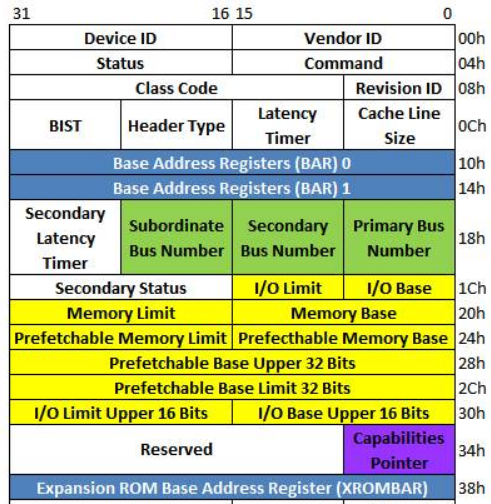

##### (若图片无法加载，请配置本地hosts文件，重新声明DNS，......或者直接科学上网！)
# 记: PCI-PCIe总线原理及TLP寻址算法
## 1.什么是PCI/PCIe
### 1.1 名词解释
PCI(Peripheral Component Interconnect)：外围设备互联标准。指由Intel定义的局部并行总线标准
PCIe(Peripheral Component Interconnect Express)：扩展外围设备互联标准。
ISA(Industry Standard Architecture)：工业标准体系结构。指由IBM定义的并行总线标准，只支持16位的I/O设备
EISA(Extend Industry Standard Architecture)：扩展工业标准体系结构。指由IBM定义的扩展总线标准，支持32位I/O设备
VLB(Video electronics standard association Local bus)：视频局部总线。指直接连接到CPU上的总线。效率极高，但干扰CPU性能，通常只用作图形卡连接
PnP(Plug and Play)：即插即用
ESCD(Extended System Configuration Data)：扩展系统配置数据。
Bus：总线。指计算机各组件之间信号传递的通道或通路
System Bus：系统总线。指连接CPU和系统内存的总线，系统中最快的总线
Local Bus：局部总线。指系统中各组件之间信号传递的总线，通过桥接器集成进系统总线；包括PCI、USB等
### 1.2 发展历程
PCI总线是有ISA总线发展而来的，ISA总线只能支持位宽8位和16位，且时钟频率为8MHz。而后IBM研发32位EISA，频率8MHz，带宽32Mb/s。
随着CPU计算能力的提高，总线带宽成为传输瓶颈。Inetl研发PCI总线，支持位宽32位和64位，频率33MHz，带宽阈值264Mb/s。  
  
## 2.PCI/PCIe如何运行
1> 打开机箱，插入网卡
2> 关上机箱，上电
3> 系统初始化BIOS
4> BIOS扫描硬件PCI总线，给连接到总线上的每一个外围设备发送信号
5> 外围设备对BIOS发出的信号，做出响应
6> BIOS扫描ESCD，检查是否有对应外围设备的数据记录
7> BIOS为外围设备分配IRQ、DMA、内存、I/O等，并保存在ESCD
8> 内核自解压，开始加载内核
9> 内核扫描ESCD，并加载外围设备驱动
10> 外围设备开始运行（网卡）
11> 网络流量通过网线进入网卡，光信号/电信号 → 数字信号（A/D → D/A）
12> 来自网卡的数字数据通过PCI总线传输至总线控制器。控制器决定各外围设备访问CPU的权重，及发送给CPU或直接写入内存
13> 系统总线将来自网卡的数字数据，写入系统内存，供上层系统调度
## 3.PCI/PCIe架构
### 3.1 PCI架构  
  
### 3.2 PCIe架构  
  
## 4.TLP寻址算法
PCI扫描，本质是按深度优先算法枚举二叉树，即TLP寻址  
  
  
1、图示为Bridge设备，接收到的TLP报文结构，并存储于相应寄存器中。
        Primary Bus Number记录上级总线号，Secondary Bus Number记录当前层级总线号，Subordinate Bus Number记录下一层级的最大总线号
2、上电后，Host Bridge识别的第一根总线记做bus0，并扫描bus0总线上挂载的设备
3、系统发现bus0总线上的Bridge设备，并初始化Bridge配置空间，将Primary Bus Number和Secondary Bus Number置位0、1，放于寄存器中，表示该Bridge设备的上游总线号是0，当前层级总线号是1，Subordinate Bus Number还未确定，默认置位255
4、以此类推，递归步骤3，直至纵深到任何节点都没有子节点的层级
5、将该层级的bus编号，置位其上一层级的Subordinate Bus Number号
6、Subordinate Bus Number号，从下到少，依次递推上去，并置于相应寄存器中
