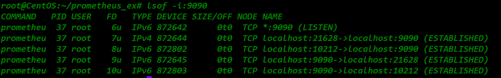
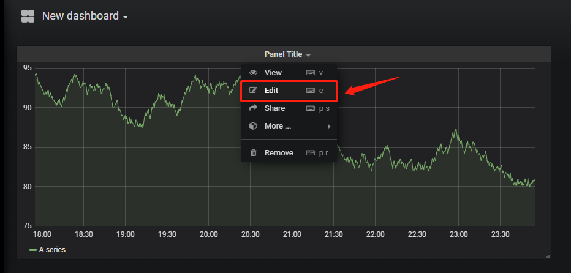

##### (若图片无法加载，请配置本地hosts文件，重新声明DNS，......或者直接科学上网！)
# 记: 基于Ubuntu20.04构建Prometheus+Grafana,实现容器级监控及可视化
## 背景概述: 
鉴于工作原因，前段时间搭建了一套websocket服务，但在实际部署中发现一些问题。由于网络稳定性原因及诸多不可控因素，经常发生ws连接偶发性中断，但服务本身又没有有效的健康检查机制。这样将对服务稳定性造成严重隐患。所以想着通过寻找引入第三方中间件，完成此任务。  
(起初，自己在本地写了个Shell脚本，循环监听进程，但毕竟太Low了，像贴膏药一样，根本拿不上台面，而且一旦Saas部署，可行性并不高)  
此时就想着要能有一套完整的监控解决方案，那该多好。  
  
**T^T 故事就这样开始了......**
## 选型分析：
Prometheus & Zabbix  
首先，观察下二者的结构图
    
   
### Prometheus：
- 基于Pull模式
- 采用TSDB
- 对应用层监控更加全面
- 支持云环境，自动发现容器，K8S提供对Prometheus的原生支持
- Alter-manager组件提供报警支持
- 时序库方便聚合分析，及UI展示  
- 集群化、持久化存储不方便、网络规划较复杂
### Zabbix：
- 基于Push模式
- 采用RDB
- 有完整的生态圈支持
- 无原生报警组件
- 对聚合数据分析及UI展示，支持欠佳  
### 对比综述：  
Prometheus在场景适配上，力压老牌的Zabbix。抛开功能完备性不谈(报警、聚合分析、数据渲染等)，瓶颈主要在DB。Zabbix默认使用常规的RDB，面对多写少读的真实监控场景，当QPS达到峰值(官方说是单机上限5000台)，RDB在IO处理上，必然影响整个系统的吞吐量，是性能的瓶颈。此时，Prometheus的时序库，完美适配了此种监控场景所需，虽然不及关系库检索时便捷，但重在时效性，碾压了各路SQL、NoSQL队友，使其在该领域脱颖而出。    
并不是说，Zabbix不够优秀，时间拨回到Zabbix出生的那个时代，它的设计绝对是非常前卫的，通吃当时的市场，但同时其也背负了太多历史的包袱。时间的巨轮一直向前滚动，面对新时代海量的数据，RDB自身的局限性，必然被新生代TSDB所取代。  
  
**T^T 毛主席说:"落后就要挨打！" 我不要挨打，所以还是用最新技术栈吧~**  
# Demo
**Operations is not roadshow. Let's do it now.**   
### 0x00 环境准备
IP：152.32.170.211(我的个人云主机)  
宿主机：CentOS-7  
镜像：Ubuntu20.04官方标准镜像  

### 0x01 配置master节点(Prometheus主服务)
先创建一个master实例，做为Prometheus服务端，实例附属宿主机网络

进入master，开始安装Prometheus  
  
使用默认配置文件，直接拉起服务  

检查端口(默认端口是9090)，可以看到服务已经通了  

通过浏览器访问一下试试(emm......不错......通了!)  
  
默认监控本机，再看下数据情况(emm......不错......有了!)  

### 0x02 配置slave节点(Exporter服务)
创建slave实例，做为Exporter服务，把宿主机目录也挂进去  
  
安装exporter(导包侠，无脑拆包就行了...)  
  
拉起服务  
 
检查端口(默认为9100)  
  
通过浏览器访问一下试试(emm......不错......有数据！)  
  
### 0x03 回到master节点，在监控对象中，加入slave节点
在配置文件中加入slave节点信息  
  
  
重启服务  
  
通过浏览器访问，可以看到两个节点的服务都能够被发现了  
  
### 0x04 安装Grafana
(因为镜像用的ubuntu，没找到deb的安装包。这里直接用rpm包在centos宿主机上跑了)  
  
  
启动服务
看一眼端口，确认下(emm......通了！)  
  
浏览器登陆，并添加prometheus数据源  
  
  
给添加好的数据源，做图形展示  
  
  
  
  
  
  
**至此，Prometheus+Grafana搭建完成**  
    
**（Onealert报警实现及消息推送，后续我会陆续补充，敬请期待......）**  
