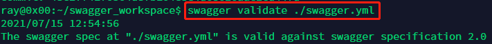
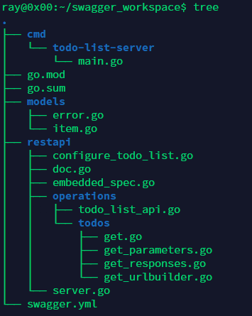

##### <font color=red>(若图片无法加载，请配置本地hosts文件，重新声明DNS，......或者直接科学上网！)</font>
# 《基于Ubuntu20.04实现go-swagger》
## 0x01 概述
```
Swagger本质上是一种用于描述使用JSON表示的RESTful API的接口描述语言。Swagger与一组开源软件工具一起使用，以设计、构建、记录和使用RESTful Web服务。Swagger包括自动文档，代码生成和测试用例生成。
```
```
现基于Golang1.16.5、Ubuntu20.04搭建go-swagger
```
## 0x02 安装go-swagger镜像
```
docker pull quay.io/goswagger/swagger

alias swagger="docker run --rm -it  --user $(id -u):$(id -g) -e GOPATH=$HOME/go:/go -v $HOME:$HOME -w $(pwd) quay.io/goswagger/swagger"
```
```
swagger version
```
## 0x02 初始化应用程序 swagger init
```
mkdir swagger-demo
cd swagger-demo
go mod init swagger-demo
swagger init spec \
  --title "A Todo list application" \
  --description "From the todo list tutorial on goswagger.io" \
  --version 1.0.0 \
  --scheme http \
  --consumes application/io.goswagger.examples.todo-list.v1+json \
  --produces application/io.goswagger.examples.todo-list.v1+json
```
## 0x03 手写YAML文件
```
vim swagger.yml
```
```
swagger: "2.0"
info:
  description: From the todo list tutorial on goswagger.io
  title: A Todo list application
  version: 1.0.0
consumes:
- application/io.goswagger.examples.todo-list.v1+json
produces:
- application/io.goswagger.examples.todo-list.v1+json
schemes:
- http
paths:
  /:
    get:
      tags:
        - todos
      parameters:
        - name: since
          in: query
          type: integer
          format: int64
        - name: limit
          in: query
          type: integer
          format: int32
          default: 20
      responses:
        200:
          description: list the todo operations
          schema:
            type: array
            items:
              $ref: "#/definitions/item"
        default:
          description: generic error response
          schema:
            $ref: "#/definitions/error"
definitions:
  item:
    type: object
    required:
      - description
    properties:
      id:
        type: integer
        format: int64
        readOnly: true
      description:
        type: string
        minLength: 1
      completed:
        type: boolean
  error:
    type: object
    required:
      - message
    properties:
      code:
        type: integer
        format: int64
      message:
        type: string
```
## 0x04 校验YAML文件
```
swagger validate ./swagger.yml
```

## 0x05 利用YAML文件，生成Golang代码
```
swagger generate server -A todo-list -f ./swagger.yml
```

