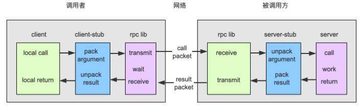
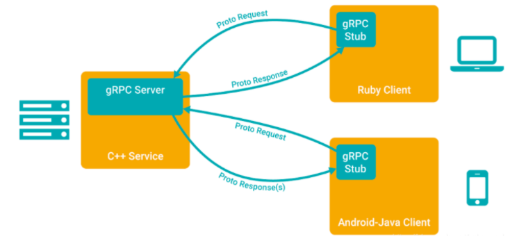
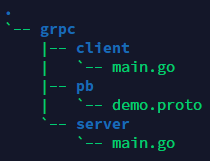

# 《基于Ubuntu20.04实现grpc-go》
## 0x01 概述
```
鉴于近期工作原因，开始学习Golang语言，并开始尝试基于Go实现RPC协议栈的调用
下面记录了过程
```
## RPC基本原理

```
RPC的执行流程：
1. 调用客户端句柄，执行传递参数。
2. 调用本地系统内核发送网络消息。
3. 消息传递到远程主机，就是被调用的服务端。
4. 服务端句柄得到消息并解析消息。
5. 服务端执行被调用方法，并将执行完毕的结果返回给服务器句柄。
6. 服务器句柄返回结果，并调用远程系统内核。
7. 消息经过网络传递给客户端。
8. 客户端接受数据。
```
## 0x02 protobuf安装

```
安装grpc之前，一定要先安装protocol buffer，实现对传输数据的序列化与反序列化
```
```
$ apt install -y protobuf-compiler
$ protoc --version  # Ensure compiler version is 3+
```
## 0x03 grpc-go安装
### 1> 安装protoc-gen-go、protoc-gen-go-grpc
```
$ go install google.golang.org/protobuf/cmd/protoc-gen-go@v1.26
$ go install google.golang.org/grpc/cmd/protoc-gen-go-grpc@v1.1
```
### 2> 声明环境变量
```
$ export PATH="$PATH:$(go env GOPATH)/bin"
```
### 3> 手动构建Demo
#### 3.1 创建如下目录树

#### 3.2 grpc/pb/demo.proto
```
syntax = "proto3";

option go_package = "grpc/pb";
option java_multiple_files = true;
option java_package = "io.grpc.examples.helloworld";
option java_outer_classname = "HelloWorldProto";

package demo;

// The greeting service definition.
service Greeter {
  // Sends a greeting
  rpc SayHello (HelloRequest) returns (HelloReply) {}
  // Sends another greeting
  rpc SayHelloAgain (HelloRequest) returns (HelloReply) {}
}

// The request message containing the user's name.
message HelloRequest {
  string name = 1;
}

// The response message containing the greetings
message HelloReply {
  string message = 1;
}
```
#### 3.3 将demo.proto转换为go代码
```
cd grpc/pb
```
```
$ protoc --go_out=. --go_opt=paths=source_relative \
    --go-grpc_out=. --go-grpc_opt=paths=source_relative \
    demo.proto
```
#### 3.4 grpc/server/main.go
```
package main

import (
        "context"
        "log"
        "net"

        "google.golang.org/grpc"
        pb "grpc/pb"
)

const (
        port = ":50051"
)

// server is used to implement helloworld.GreeterServer.
type server struct {
        pb.UnimplementedGreeterServer
}

// SayHello implements helloworld.GreeterServer
func (s *server) SayHello(ctx context.Context, in *pb.HelloRequest) (*pb.HelloReply, error) {
        log.Printf("Received: %v", in.GetName())
        return &pb.HelloReply{Message: "Hello " + in.GetName()}, nil
}

func (s *server) SayHelloAgain(ctx context.Context, in *pb.HelloRequest) (*pb.HelloReply, error) {
        return &pb.HelloReply{Message: "Hello again " + in.GetName()}, nil
}

func main() {
        lis, err := net.Listen("tcp", port)
        if err != nil {
                log.Fatalf("failed to listen: %v", err)
        }
        s := grpc.NewServer()
        pb.RegisterGreeterServer(s, &server{})
        if err := s.Serve(lis); err != nil {
                log.Fatalf("failed to serve: %v", err)
        }
}
```
#### 3.5 grpc/client/main.go
```
package main

import (
        "context"
        "log"
        "os"
        "time"

        "google.golang.org/grpc"
        pb "grpc/pb"
)

const (
        address     = "localhost:50051"
        defaultName = "world"
)

func main() {
        // Set up a connection to the server.
        conn, err := grpc.Dial(address, grpc.WithInsecure(), grpc.WithBlock())
        if err != nil {
                log.Fatalf("did not connect: %v", err)
        }
        defer conn.Close()
        c := pb.NewGreeterClient(conn)

        // Contact the server and print out its response.
        name := defaultName
        if len(os.Args) > 1 {
                name = os.Args[1]
        }
        ctx, cancel := context.WithTimeout(context.Background(), time.Second)
        defer cancel()
        r, err := c.SayHello(ctx, &pb.HelloRequest{Name: name})
        if err != nil {
                log.Fatalf("could not greet: %v", err)
        }
        log.Printf("Greeting: %s", r.GetMessage())
        r, err = c.SayHelloAgain(ctx, &pb.HelloRequest{Name: name})
        if err != nil {
                log.Fatalf("could not greet: %v", err)
        }
        log.Printf("Greeting: %s", r.GetMessage())
}
```
#### 3.6 生成mod.go和sum.go文件
```
$ cd grpc
$ go mod init grpc
$ go mod tidy
```
#### 3.7 启动Server端
```
$ cd grpc/server
$ go run main.go
```
#### 3.8 启动Client端
```
$ cd grpc/client
$ go run main.go
```