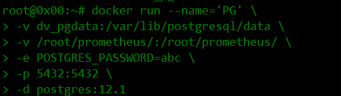
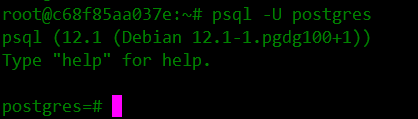
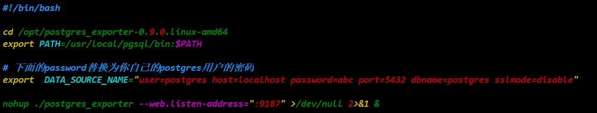
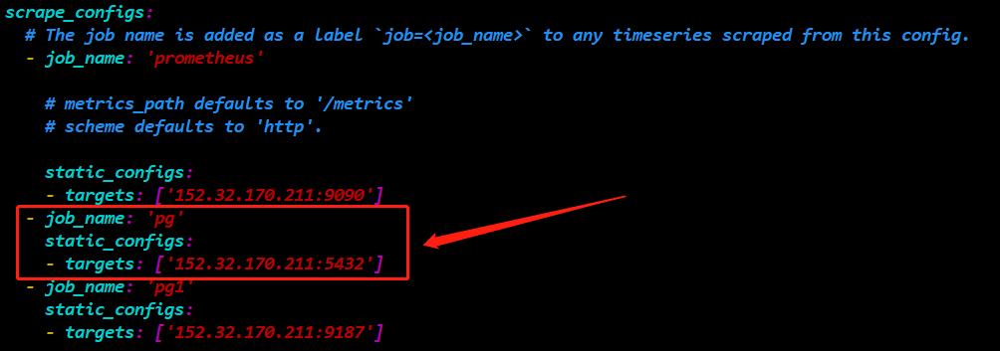
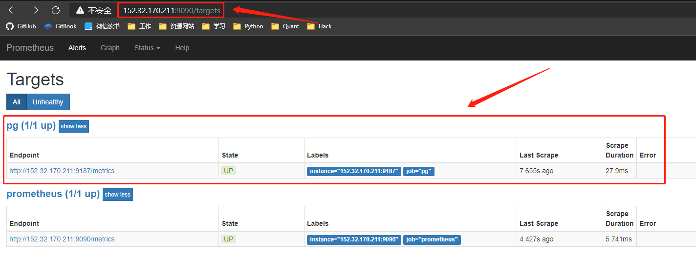

##### <font color=red>(若图片无法加载，请配置本地hosts文件，重新声明DNS，......或者直接科学上网！)</font>
# 记：基于Docker搭建postgresql数据库
### 一、拉取postgres镜像
 
```
docker pull postgres
```
### 二、构建镜像容器
 
```
docker volume create dv_pgdata
```
 
```
docker run -itd --name='PG' --restart always \
> -e POSTGRES_PASSWORD=abc \
> -e ALLOW_IP_RANGE=0.0.0.0/0 \
> -p 5432:5432 \
> -p 9187:9187 \
> -v /root/prometheus/:/root/prometheus/ \
> -v dev_pgdata:/var/lib/postgresql/data/ \
> -d postgres:12.1
```
### 三、进入容器
 
```
docker exec -it PG /bin/bash
```
### 四、进入postgresql数据库
 
```
psql -U postgres
```
### 五、配置prometheus监控PG数据库
 
```
tar xf postgres_exporter-0.9.0.linux-amd64.tar.gz -C /opt/
```
 
```
cd /opt/postgres_exporter-0.9.0.linux-amd64/
```
 
```
vim start.sh
```
 
```
#!/bin/bash

cd /opt/postgres_exporter-0.9.0.linux-amd64
export PATH=/usr/local/pgsql/bin:$PATH

# 下面的password替换为你自己的postgres用户的密码
export  DATA_SOURCE_NAME="user=postgres host=localhost password=abc port=5432 dbname=postgres sslmode=disable"

nohup ./postgres_exporter --web.listen-address=":9187" >/dev/null 2>&1 &
```
 
```
vim /usr/local/prometheus/prometheus.yml
```

```
- job_name: 'pg'
    static_configs:
    - targets: ['152.32.170.211:5432']
- job_name: 'pg1'
    static_configs:
    - targets: ['152.32.170.211:9187']
```

```
pkill prometheus
```

```
/usr/local/prometheus/prometheus --config.file="/usr/local/prometheus/prometheus.yml" &
```

